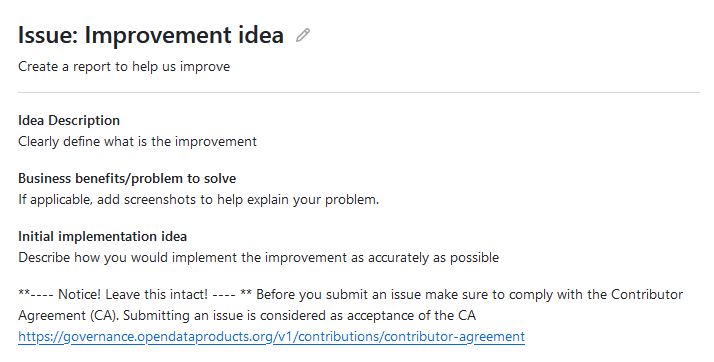

# Contributions

To ensure consistency and transparency in ODPS development we have defined a process to follow in order to contribute.&#x20;

We have different processes for breaking and non-breaking changes simply because we need to assure backwards compatability in versions. Read more about versioning from separate page under Specification: [versioning-practices.md](../specification/versioning-practices.md "mention")&#x20;

If you don't know is the change breaking change or nor, don't worry. Follow the standard process and maintainers will make the jugdment and act accordingly. But of course optimal solution is known or suspected breaking change cases is to use given process. That speeds up the processing and possible merge.&#x20;

### Contributions require lightweight Contributor Agreement

But don't worry. This process could be hard and heavy. In some cases, it has to be hard and heavy. We are still a bit relaxed with this requirement. If you raise and issue or make a feature request, or propose improvement in Github (the only way to contribute in the ODPS), you are notified that by using the issue reporting you to accept the [contributor-agreement.md](contributor-agreement.md "mention"). Link to Contributor Agreement is presented in issue templates along with notice text of approval.&#x20;

We also utilize Github built-in "contributors to sign off on web-based commits" function.&#x20;

An example of the above is the template (below) in Github we use for improvement ideas. The same model is used in bug reports

<figure><figcaption></figcaption></figure>

Later on, we might need to go to a heavier and more formal process of requiring signed CAs but for now, we proceed with this lightweight model.&#x20;

