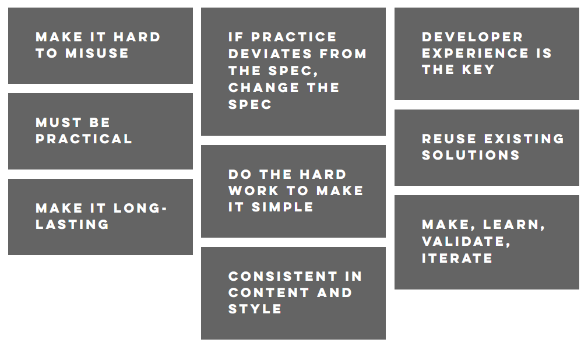

# Design

We apply design-thinking in the development of the Open Data Product Specification. To guide us in development, we have defined 9 design principles that must be kept in mind all the time.&#x20;

<figure><figcaption></figcaption></figure>
